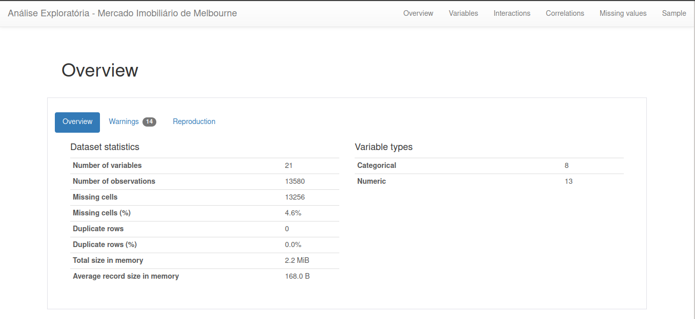

# Análise Exploratória com Pandas Profiling

Você pode entender o passo a passo da análise lendo o [artigo](https://feduardomelo.medium.com/pandas-profiling-a-ferramenta-que-vai-tunar-sua-an%C3%A1lise-explorat%C3%B3ria-376726765f83) que eu escrevi no Medium.

Além disso, pode consultar o relatório gerado [aqui](https://zen-cray-67262f.netlify.app/).

